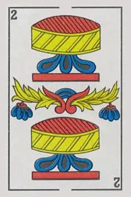
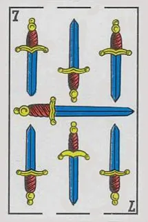
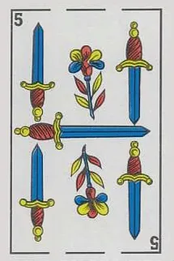

# 🃏 Carta - Moroccan Card Games

A real-time multiplayer card games, played with the traditional 40-card Spanish-suited deck.

## The Cards

<p align="center">
  
  
  
  
  
  
  
  
</p>

## Special Cards

| Card | Effect | Description |
|------|--------|-------------|
| **2s** | +2 | Next player draws 2 cards (stackable) |
| **1 of Coins** | +5 | Next player draws 5 cards (stackable with 2s) |
| **10s** | Skip | Skip the next player's turn |
| **7s** | Wild | Choose any suit for the next player |

## Quick Start

```bash
# Install all dependencies
npm install

# Run both client and server in dev mode
npm run dev
```

- **Client**: http://localhost:3000
- **Server**: http://localhost:3001

## Project Structure

```
ronda/
├── shared/            # Shared TypeScript types & interfaces
│   └── src/
│       └── index.ts
├── server/            # Express + Socket.IO backend
│   └── src/
│       ├── index.ts          # Server entry point
│       ├── game/
│       │   ├── deck.ts       # Deck creation, shuffle, card effects
│       │   └── engine.ts     # Authoritative game engine
│       ├── rooms/
│       │   └── roomManager.ts  # Room lifecycle management
│       └── socket/
│           └── handlers.ts   # Socket.IO event handlers
├── client/            # Vite + React frontend
│   └── src/
│       ├── App.tsx
│       ├── main.tsx
│       ├── index.css
│       ├── components/
│       │   ├── Card.tsx          # Card with real images
│       │   ├── CenterArea.tsx    # Draw & discard piles
│       │   ├── ChatPanel.tsx     # In-game chat
│       │   ├── GameBoard.tsx     # Main game table layout
│       │   ├── HomeScreen.tsx    # Create / join room
│       │   ├── Lobby.tsx         # Pre-game lobby
│       │   ├── OpponentHand.tsx  # Other players' cards
│       │   ├── PlayerHand.tsx    # Your hand (fan layout)
│       │   └── SuitSelector.tsx  # Wild suit picker
│       └── lib/
│           ├── cardUtils.ts      # Suit symbols, colors, effect labels
│           ├── gameLogic.ts      # Client-side play validation
│           ├── socket.ts         # Socket.IO singleton
│           ├── store.ts          # Zustand state management
│           └── useSocketEvents.ts  # Socket event listeners
└── package.json       # Monorepo root (npm workspaces)
```

## How to Play

1. **Create or Join** a room (share the invite link with friends)
2. **Match** the top card by suit or value
3. **Draw** from the deck if you can't play
4. **Use special cards** strategically - stack +2s and +5s!
5. **First to empty** their hand wins

## Tech Stack

- **Frontend**: React 18, TypeScript, Vite, Tailwind CSS, Zustand
- **Backend**: Node.js, Express, Socket.IO
- **Monorepo**: npm workspaces
- **Real-time**: Socket.IO with server-authoritative game state